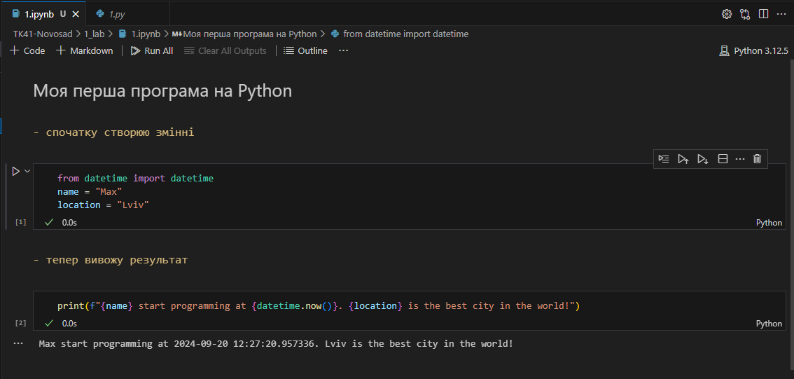
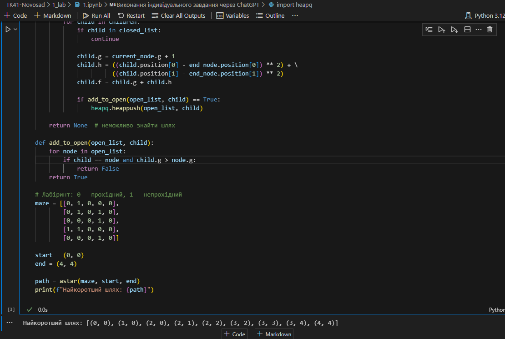

# Звіт до роботи №1
## Тема: _Вступ та оформлення робіт_
### Мета роботи: _Налаштувати локальне середовище розробки, створити Github репозиторій, оформлення робіт з використанням форматування Markdown_

---
### Виконання роботи
* Результати виконання завдань:
    1. Налаштував Visual Studio Code для роботи з Github;
    1. Створив репозиторій [TK41-Novosad](https://github.com/smile047/TK41-Novosad);
    1. Попрацював з форматуванням Markdown та заповнили початкову сторінку;
    1. Почали оформляти першу роботу:
        - створили [файл з розширенням py](./1.py) та скопіювали тест програми та запустили програму.
        - Результат виконання програми представлений на скріншоті
        ;
    1. Cтворив [Пайтон ноутбук файл](1.ipynb) ,
    скопіював код та запустив його, результат виконання наступний:
    1. Навчився запускати пайтон програми 

    ### Індивідуальне завдання з ChatGPT
1. Написав Алгоритм A* для пошуку шляху в лабіринті. Результат в [папці](1.ipynb)
2. Скріншот виконаного коду: 

---
### Висновок:
> відповіді на запитання :

- __Що зроблено в роботі?__ Відповідь: Створено акаунт __GitHub__, репозиторій, та виконано першу лабораторну.
- __Чи досягнуто мети роботи?__ Відповідь: Так. Я досягнув мети роботи.
- __Які нові знання отримано?__ Відповідь: Вивчив базове розуміння мови __Python.__
- __Чи вдалось відповісти на всі питання задані в ході роботи?__ Відповідь: Так. Відповів на всі задані питання.
- __Чи вдалося виконати всі завдання?__ Відповідь: Так. Виконав всі завдання.
- __Чи виникли складності у виконанні завдання?__ Відповідь: Дуже рідко і то по дрібницях.
- __Чи подобається такий формат здачі роботи (Feedback)?__ Відповідь: Так, дуже подобається.
- __Побажання для покращення (Suggestions)?__ Відповідь: Ні, не має. Я зрадістю буду продовжувати вивчати матеріал з такою подачою.

---